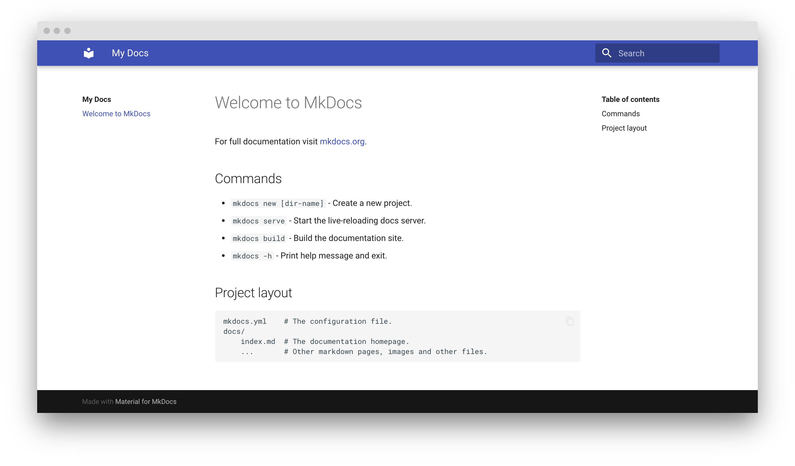

---
hide:
  - navigation
---

## Getting started

Open your terminal and type: 
```
mkdocs new . 
```
This creates template files for the website in your current directory. Your folder now contains the following:
```
.
├── docs/
│   └── index.md
└── mkdocs.yml
```

##### The docs folder

Over the course of this workshop we will heavily populate the docs folder with different kind of files. All the content you want to display on your website in form of text or images will live in this folder. Most of the time, this content is written with Markdown which enables you to do nice formatting, include code-chunks, images, tables etc. etc.

##### The YAML-file

The mkdocs.yml file determines the settings of your website. In this file you state in which order you want your content (navigation), which theme, color, font, language; change icons and copyright etc. etc. 

**Find more background information on Markdown and YAML in the [Google Slides].**

After you created the template folder you can already check how the template website looks by creating a localhost address. For this, you simply have to type the following command in the terminal (inside your website directory): 
```
mkdocs serve
```
Copy the [localhost:8000] into a browser tab. You can now see how the template website looks like: 




It will always automatically update as soon as you change something in your configurations (i.e., the YAML file) or your content (i.e., in your Markdown files). 

## First Customizations

As mentioned above, you can customize your website regarding a lot of features. The documentation of mkdocs-material is very comprehensive and easily understandable. Please visit their [setup page] and go through the first four configurations: 

- colors 
- fonts 
- language 
- logo and icons

Every time you changed something, you can check it in your browser via the localhost address.

## Filling your website with content


[Google Slides]: https://docs.google.com/presentation/d/16Rgdn_-uqjZVwmeyDhGL41vKMRCFA0dSom2IpreZ59I/edit?usp=sharing
[setup page]: https://squidfunk.github.io/mkdocs-material/setup/
[localhost:8000]:http://localhost:8000