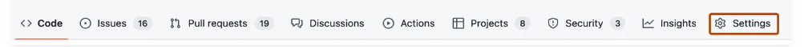
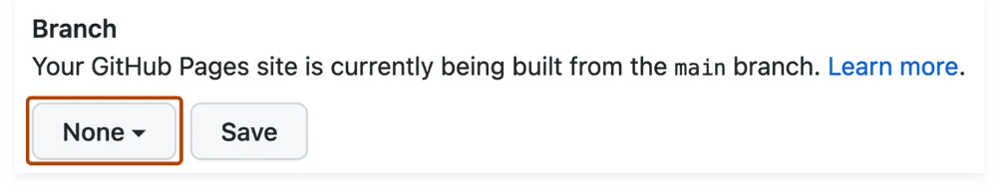
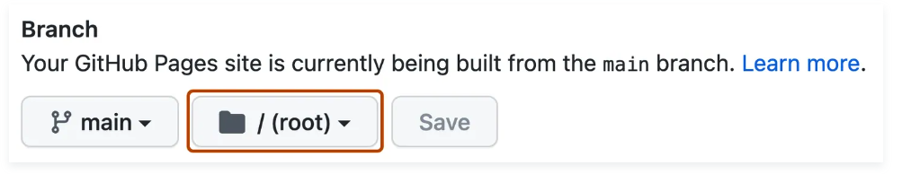

So far, we only build a local site, meaning that only you can see your website in your browser. To make our website public, we need to deploy it. For this, we are going to use the continuous deployment service of GitHub Pages. You can find background information on what deployment means and continuous deployment on GitHub in these [Google Slides]. 

##### Task 1

Create a new hidden folder in your website folder called ```.github```. Within this folder create again a new folder called ```workflows```. Your folder hierarchy should look like this: 

```
.
├── docs
│   ├── artifacts
│   │   └── example.pdf
│   ├── assets
│   │   └── images
│   │       ├── creating-your-site.png
│   ├── index.md
├── .github
│   ├── workflows
└── mkdocs.yml

```
???+ note "```.github```"

    1.  You will not see this folder because folders starting with a period are hidden folders. To make hidden folders visible, you can apply a certain keyboard command. This command is different for different OS. Please google yourself what command it is for your OS.  


Inside this folder create a new file called ```ci.yml```. Paste the following inside the ```ci.yml``` file:

```yaml
name: ci 
on:
  push:
    branches:
      - master 
      - main
permissions:
  contents: write
jobs:
  deploy:
    runs-on: ubuntu-latest
    steps:
      - uses: actions/checkout@v4
      - uses: actions/setup-python@v4
        with:
          python-version: 3.x
      - run: echo "cache_id=$(date --utc '+%V')" >> $GITHUB_ENV 
      - uses: actions/cache@v3
        with:
          key: mkdocs-material-${{ env.cache_id }}
          path: .cache
          restore-keys: |
            mkdocs-material-
      - run: pip install mkdocs-material 
      - run: mkdocs gh-deploy --force
```

##### Task 2

If you haven't done already, initialize Git in your local repository:
```bash
cd my-website-folder
```
```bash
git init
```
```bash
git add . && git commit -m "commit message" 
```

???+ note "```git add . && git commit```"

    This will add AND commit ALL files in your folder. If you want to exclude files from being version controlled by git, you have to add files or folders separately. 

##### Task 3

Go to your profile on GitHub and set up a new repository for your website:

- Click on "New"
- Give your repository a name, click "public"(1), and make sure that you **don't** add a README.md (for now)
{ .annotate }

    The repository has to be public, otherwise you can't use the deployment service of GitHub pages.

- Follow the instructions given by GitHub on how to push your local repository to GitHub (*"Push an existing git repository"*). Refresh the GitHub repo. 

???+ note "Pushing to GitHub"

    You need to have an SSH key set up to be able to push to and pull from GitHub. Otherwise you will run in unneccessary troubles. Please visit the GitHub info page for instructions on how to do that.  


##### Task 4

1. After you pushed your repository to GitHub, please go to *"Settings"* of your repository. 



2. Go to the section *"Pages"* under the left sidebar.
3. Under "Build and deployment", use the branch dropdown menu and select a publishing source.



4. Change "None" to "gh_pages".



5. ==Click "Save".==

If you've done all these steps, the deployment workflow should have been triggered and your website is deployed.

##### Task 5

1. Go to *"Actions"* in your repository.
2. Click on *"pages build and deployment"*. You now see the deployment workflow.
3. Under *"deployment"* you see a link. This is the link to your website. The link will always stay the same as long as you use this repository. 

#### Future development of your website

You're website is now officially online. If you want to make updates on your website, you can do that either locally in your folder (like before) or directly in the GitHub repository. Either way, the important things to remember are:

- Your local folder is now linked to a GitHub repository. The deployment is done over the GitHub repository. Every change you make in your local website folder needs to be **pushed to GitHub** in order to be updated on your website. Don't let yourself be confused by the changes you see when you look at your website locally via the localhost address. ==YOUR CHANGES ARE NOT ONLINE UNLESS THEY ARE DEPLOYED BY GITHUB!==

- If you make changes in GitHub and later decide to continue working locally, you need to do a **```git pull```** first to integrate the changes you made in GitHub into your local git repository. 


[Publishing your site]: https://squidfunk.github.io/mkdocs-material/publishing-your-site/
[Google Slides]: https://docs.google.com/presentation/d/16Rgdn_-uqjZVwmeyDhGL41vKMRCFA0dSom2IpreZ59I/edit?usp=sharing