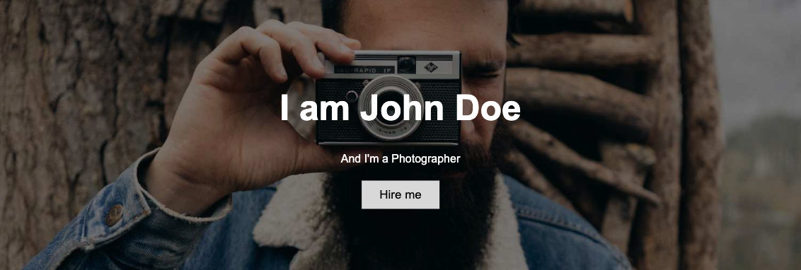

The landing page is the first page people see when they visit your website. As your primary goal with a personal website is to introduce *yourself*, my recommendation for a landing page is the following:

- display a welcome-statement to welcome the visitors on your website
- put a picture of yourself, preferably in the center of the landing page
- show your contact information in form of icons 
- name a few buzz-words which describe yourself and your skills best
- link to the most important section on your website

### Using Markdown only

Surely, you can just apply your newly acquired Markdown-skills to create a landing page. For example, the landing page of this website was created using only Markdown. 

You can use [images] and [buttons] combined with a text. See my `index.md` file as template. How to insert contact information in form of buttons will be shown in the next section "Pretty and useful extras".


### Using Markdown including html configurations

Sometimes you want a bit more customization than the Markdown syntax allows. Luckily, the Markdown syntax allows to insert plain html code. With this, you can apply the more flexible html configurations within your .md-file without having to learn all of the html language. 

With the following tasks, you can create a landing page looking similar to this:



##### Task 

Try to use [html styles] to format and align your text (e.g., put a big text in the middle of the page). **Please see this [HTML info page] for formatting in html language.**

Here is an example code for a landing page shown in the image above: 

```html
---
hide:
  - navigation
  - toc
---
<!--/* Background image: applies to the "body" of the page */-->
<!--/* background-repeat: if image should keep original size and repeat itself until full page is covered */-->
<!--/* background-size and position to make image cover full page and don't stretch when changing the browser's window size */-->
<style>
body {
  background-image: url('../assets/images/landing.png');
  background-repeat: no-repeat;
  background-position: center;
  background-size: cover;
  position: relative;
}
</style>

<!--/* Or background color instead: 
<body style="background-color:aquamarine;"></body> */-->

<!--/* Text alignement */-->
<!--/* position, top, left, transofrm: vertical alignement; number is for how many pixels the text is shifted downwards*/-->
<!--/* text-align: horizontal alignement */-->
<b><h1 style="position: absolute; top: 35%; left: 50%; transform: translate(-50%, -50%); font-size:300%; color:black; text-align:center">NOWA Workshop</h1></b>

<p style="position: absolute; top: 40%; left: 50%; transform: translate(-50%, -50%); font-size:150%; color:black; text-align:center"> Welcome and buzzwords</p>

<!--/* One button in the middle of the page */-->
<b><h3 style="position: absolute; top: 50%; left: 50%; transform: translate(-50%, -50%); margin: auto; text-align:center"><button>[Get to know me](link to next page){ .md-button .md-button--primary }</button></h3></b>

<!--/* Buttons with social media icons next to each other */-->
<b><h3 style="position: absolute; top: 60%; left: 35%; transform: translate(-50%, -50%); margin: auto; text-align:center"><button>[:fontawesome-brands-github:](link){ .md-button .md-button--primary }</button></h3></b>

<b><h3 style="position: absolute; top: 60%; left: 45%; transform: translate(-50%, -50%); margin: auto; text-align:center"><button>[:fontawesome-brands-linkedin:](link){ .md-button .md-button--primary }</button></h3></b>

<b><h3 style="position: absolute; top: 60%; left: 55%; transform: translate(-50%, -50%); margin: auto; text-align:center"><button>[:simple-researchgate:](link){ .md-button .md-button--primary }</button></h3></b>

<b><h3 style="position: absolute; top: 60%; left: 65%; transform: translate(-50%, -50%); margin: auto; text-align:center"><button>[:simple-twitter:](link){ .md-button .md-button--primary }</button></h3></b>
```

### Even more html configurations

If you want to customize even more in html language (like blocking out the header and footer on the landing page), it makes sense to override the whole theme of Material for MkDocs and use your own html configurations for EVERYTHING. With this you have more freedom but also more work. See below an example setup for a `home.html` and `main.html` file. 

**1.**

Create a `home.html` in your `overrides` directory and put the following content:
```html

  
    {{ super() }}

  <!--/* Add library for social media buttons */ -->  
  <link rel="stylesheet" href="https://cdnjs.cloudflare.com/ajax/libs/font-awesome/4.7.0/css/font-awesome.min.css">    
    
  <style>
  body 
  /* Use "linear-gradient" if you want to add a darken background effect to the image. This will make the text easier to read */
  {background-image: linear-gradient(rgba(0, 0, 0, 0.5), rgba(0, 0, 0, 0.5)), url('../assets/images/landing.png'); 
    
  /* If you want a background color instead of an image: 
  background-color:powderblue;*/

  /* Position and center the image to scale nicely on all screens */
  background-position: center;
  background-repeat: no-repeat;
  background-attachment: fixed; 
  background-size: cover;

  /* Place text in the middle of the image */
  text-align: center;
  position: absolute;
  top: 50%;
  left: 50%;
  transform: translate(-50%, -50%);
  color: white;}

  /* Fixate page */
  .md-header{position:initial}
  .md-main__inner{margin:0}
  .md-content{display:none}@media screen and (min-width:60em){.md-sidebar--secondary{display:none}}@media screen and (min-width:76.25em){.md-sidebar--primary{display:none}}
  </style>

  <!--/* Start content */-->
      <div>
            
  <!--/* Use attributes to define color, size, and alignment of your text; for ALL of the text, not just the header */-->
      <header style="color:white; font-size:50px;"> My header</header>
      <h1 style="color:white; font-size:30px;">Smaller heading</h1> 
      <h2 style="color:white; font-size:20px;">Even smaller heading</h2> 
      <p><br/>This is a very small text without resizing</p>
      <p>This is a reference to another website within a text: <a href="url to website">Name</a></p>

      <!--If you want to put an image:
      -->
            
      <!--/* This is a button */-->
      <button onclick="link;" type="button" padding="10px" style="background:white; color: black;" >Get started</button>

      <p><br/><br/><small>This is a suuuuper small text</p></small> 

      <!--/* Use social media buttons; don't forget to size and color the button */-->
      <a href="https://twitter.com/jk_pfarr" class="fa fa-twitter"></a>

      </div>
    
  
        
```

**Please see this [HTML info page] for formatting in html language.**

**2:**

Create another file in the same directory called `main.html` with the following content:
```html

```

**3.**

Open your `index.md` file and put the following content:
```md
---
template: overrides/home.html
---
```


[images]: https://squidfunk.github.io/mkdocs-material/reference/images/
[buttons]: https://squidfunk.github.io/mkdocs-material/reference/buttons/
[icons]: https://squidfunk.github.io/mkdocs-material/reference/icons-emojis/
[HTML info page]: https://www.w3schools.com/html/default.asp
[html styles]: www.w3schools.com/html/html_styles.asp
[background image]: https://www.w3schools.com/html/html_images_background.asp
[background color]: https://www.w3schools.com/html/tryit.asp?filename=tryhtml_styles_background-color
